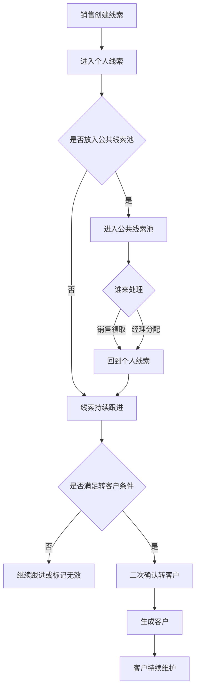
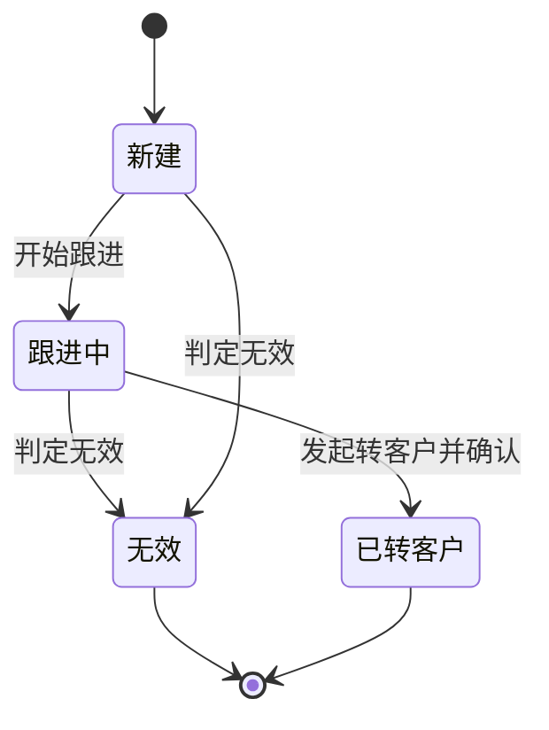

# 第一期产品需求文档

> **版本**：第一版 | **日期**：2026-06-03 | **整理人**：系统整理

---

## 一句话说清楚

第一期要先做出一套可演示的智能客户关系管理闭环，跑通线索、公共线索池、客户三块核心能力。

---

## 1. 背景与问题

### 现状是什么

当前希望做的是一套以智能能力为亮点的客户关系管理演示系统，但如果一开始把所有模块都铺开，范围会过大，难以快速形成可演示成果。

现阶段最核心的业务主链路，其实是：

- 手工创建线索
- 线索在个人和公共线索池之间流转
- 销售持续跟进线索
- 线索转化为客户
- 客户进入后续维护阶段

如果这条链路跑不通，后面的商机、日报、团队管理等模块即使存在，也很难形成有说服力的演示效果。

### 为什么现在要做

当前的目标不是先做一个大而全的系统，而是先完成一个边界清晰、流程完整、智能能力可见的第一期版本。

第一期完成后，可以直接用于：

- 对外演示智能客户关系管理能力
- 对内验证核心业务流程是否顺畅
- 作为后续扩展商机、日报、团队管理等模块的基础底座

---

## 2. 目标

### 做成什么样

第一期要做到的不是模块数量多，而是要让主流程真正可用、可演示、可继续扩展。

- 目标 1：完成线索、公共线索池、客户三块核心业务闭环
- 目标 2：支持页面操作和智能助手操作两种方式
- 目标 3：关键业务动作具备日志和追溯能力

### 怎么衡量成功

| 指标 | 当前值 | 目标值 | 说明 |
|------|--------|--------|------|
| 主流程可演示程度 | 无 | 可完整演示 | 从创建线索到转客户全链路可跑通 |
| 核心页面可用程度 | 无 | 全部可用 | 线索、公共线索池、客户相关页面可正常操作 |
| 智能助手覆盖动作数 | 无 | 不少于 5 类 | 至少覆盖创建、查询、跟进整理、领取分配、转客户 |
| 关键动作可追溯程度 | 无 | 全覆盖 | 关键动作都有日志记录 |

### 不做什么

- 不做商机过程
- 不做日报
- 不做团队管理面板
- 不做合同管理、回款管理、财务管理、售后管理
- 不做多公司隔离
- 不做多租模式
- 不做自定义角色
- 不做一人多角色
- 不做线索导入和外部来源接入

---

## 3. 用户与场景

### 目标用户

| 用户角色 | 特征描述 | 核心诉求 |
|----------|----------|----------|
| 销售 | 负责线索跟进和客户维护 | 快速创建线索、领取线索、记录跟进、转客户 |
| 销售经理 | 管理团队线索流转和转化效率 | 分配线索、收回线索、查看团队流转情况 |
| 系统管理员 | 维护系统账号和基础配置 | 保证账号、角色、日志可管理 |

### 核心使用场景

**场景 1：销售手工录入新线索**
> 销售拿到一个新客户信息后，需要尽快录入系统，避免信息散落在聊天记录或个人笔记里，同时后续还能继续跟进和转化。

**场景 2：团队处理公共线索**
> 一批尚未明确归属的线索进入公共线索池后，销售可以自由领取，销售经理也可以统一分配或强制收回，以便控制线索利用效率。

**场景 3：销售将成熟线索转成客户**
> 线索经过多次跟进后，已经具备明确合作价值，销售希望一键转为客户，同时保留历史跟进记录，不用重复录入。

**场景 4：通过智能助手完成快捷操作**
> 用户不想每次都手工点页面时，可以直接通过自然语言让智能助手创建线索、查询线索、整理跟进或发起转客户。

---

## 4. 整体流程

第一期围绕“线索进入、流转、跟进、转化、沉淀为客户”展开。系统既支持页面手工操作，也支持通过智能助手发起操作，但最终都落到同一套业务规则和同一套数据底座上。





---

## 5. 需求详述

### 5.1 智能助手操作台

**做什么**：让用户通过自然语言完成线索、公共线索池、客户相关的查询和操作。

**业务规则**：
1. 智能助手只覆盖第一期三块范围，不处理商机、日报等内容。
2. 创建线索和普通编辑可直接执行。
3. 转客户和删除类动作必须二次确认。
4. 智能助手发起的动作也必须写入操作日志。
5. 智能助手页面采用左右分栏布局，结构化结果与待执行内容放在左侧，对话区固定在右侧。

**用户操作流程**：
1. 用户进入智能助手操作台。
2. 用户输入自然语言指令。
3. 系统识别意图并给出理解结果。
4. 如果是普通查询或创建，系统直接执行并返回结果。
5. 如果是转客户或删除类动作，系统先展示待确认信息。
6. 用户确认后，系统再正式执行。

**异常与边界**：

| 异常情况 | 系统行为 | 用户看到什么 |
|----------|----------|------------|
| 指令无法理解 | 不执行 | 提示需要补充更明确的信息 |
| 信息不完整 | 不执行 | 提示缺少必要字段 |
| 无权限执行 | 拒绝执行 | 提示当前角色无权限 |
| 转客户前置条件不满足 | 不执行 | 提示当前线索不可转客户 |

**页面布局**：
```text
+----------------------------------------------------------------------------------+
| 智能助手操作台                                                     [用户] [退出] |
+----------------------------------------------------------------------------------+
| 输入你的需求: [__________________________________________________________] [发送] |
+--------------------------------------+-------------------------------------------+
| 结果区                               | 会话区                                    |
|                                      |                                           |
| 识别结果: 创建线索                   | 用户: 帮我创建一个新线索                  |
| 待写入字段:                          | 助手: 已识别为创建线索                    |
| - 线索名称                           | 用户: 联系人张三，手机号 138xxxxxx        |
| - 联系人                             | 助手: 请确认是否创建                      |
| - 手机号码                           |                                           |
| [确认执行] [取消]                    |                                           |
+--------------------------------------+-------------------------------------------+
```

**验收标准**：
- [ ] 用户输入创建线索指令，系统能识别并创建成功
- [ ] 用户输入查询线索指令，系统能返回符合条件的数据
- [ ] 用户发起转客户指令时，系统必须先展示二次确认
- [ ] 无权限用户发起受限动作时，系统明确提示无权限

---

### 5.2 我的线索列表与新建编辑

**做什么**：支持销售和销售经理查看、筛选、创建、编辑个人线索。

**业务规则**：
1. 线索本期只支持手工创建。
2. 线索至少要有线索名称、联系人姓名、手机号码、来源、负责人、状态。
3. 线索状态固定为新建、跟进中、无效、已转客户。
4. 已转客户的线索不能再次转客户。

**用户操作流程**：
1. 用户进入我的线索列表页。
2. 用户通过筛选条件查看自己的线索。
3. 用户点击新建，进入线索新建页。
4. 用户填写基础信息并保存。
5. 保存后返回列表，或进入线索详情继续跟进。

**异常与边界**：

| 异常情况 | 系统行为 | 用户看到什么 |
|----------|----------|------------|
| 必填字段缺失 | 不允许保存 | 提示缺少必填信息 |
| 手机号码格式明显异常 | 不允许保存 | 提示检查手机号格式 |
| 重复线索疑似存在 | 提示确认 | 提示可能重复，请确认是否继续 |

**页面布局**：
```text
+----------------------------------------------------------------------------------+
| 我的线索                                                                [+ 新建] |
+----------------------------------------------------------------------------------+
| 线索名称 [________]  手机号 [________]  状态 [全部 v]  负责人 [我的 v]  [查询]   |
+----------------------------------------------------------------------------------+
| 编号 | 线索名称 | 联系人 | 手机号 | 来源 | 状态 | 负责人 | 更新时间 | 操作       |
|------|----------|--------|--------|------|------|--------|----------|------------|
| 001  | 某企业合作 | 张三   | 138... | 手工 | 新建 | 王五   | 今天     | 查看 编辑  |
| 002  | 渠道推荐   | 李四   | 139... | 手工 | 跟进中 | 王五 | 昨天     | 查看 编辑  |
+----------------------------------------------------------------------------------+
```

```text
+----------------------------------------------------------------------------------+
| 新建线索                                                                         |
+----------------------------------------------------------------------------------+
| 线索名称:   [____________________________________]                               |
| 联系人姓名: [____________________________________]                               |
| 手机号码:   [____________________________________]                               |
| 公司名称:   [____________________________________]                               |
| 来源:       [手工创建 v]                                                         |
| 负责人:     [选择销售人员 v]                                                     |
| 当前状态:   [新建 v]                                                             |
| 备注:       [________________________ 多行输入 _____________________________]     |
+----------------------------------------------------------------------------------+
| [取消]                                                                [保存线索] |
+----------------------------------------------------------------------------------+
```

**验收标准**：
- [ ] 销售可以新建并保存自己的线索
- [ ] 线索列表支持按名称、手机号、状态查询
- [ ] 必填信息缺失时，系统不允许保存
- [ ] 已转客户线索不会再次出现转客户入口

---

### 5.3 线索详情与跟进

**做什么**：在线索详情页查看基础信息、记录跟进、退回公共线索池、发起转客户。

**业务规则**：
1. 线索阶段必须支持跟进记录。
2. 跟进记录在线索转客户后要保留并可追溯。
3. 销售可以把自己的线索退回公共线索池。
4. 转客户前必须校验状态和必要信息。

**用户操作流程**：
1. 用户从列表进入线索详情页。
2. 用户查看线索基础信息和历史跟进。
3. 用户新增一条跟进记录。
4. 用户根据情况选择继续跟进、退回公共池或转客户。
5. 如果选择转客户，系统先弹出确认信息，再执行转换。

**异常与边界**：

| 异常情况 | 系统行为 | 用户看到什么 |
|----------|----------|------------|
| 线索已转客户 | 不允许重复转化 | 提示当前线索已完成转化 |
| 当前用户不是负责人且不是经理 | 不允许操作 | 提示无操作权限 |
| 缺少必要信息 | 不允许转化 | 提示需先补齐信息 |

**页面布局**：
```text
+----------------------------------------------------------------------------------+
| 线索详情：某企业合作                                  [退回公共池] [转客户] [编辑] |
+----------------------------------------------------------------------------------+
| 基础信息                                                                         |
| 线索名称：某企业合作         联系人：张三         手机：138xxxxxxxx               |
| 公司名称：某企业             来源：手工创建       状态：跟进中                    |
| 负责人：王五                 更新时间：2026-06-03                                |
+----------------------------------------------------------------------------------+
| 跟进记录                                                               [+ 新增跟进]|
| 06-03  王五  电话    已沟通需求，约明天继续跟进                                    |
| 06-02  王五  微信    初次建立联系                                                  |
+----------------------------------------------------------------------------------+
| 新增跟进                                                                         |
| 跟进方式: [电话 v]    跟进时间: [2026-06-03 10:00]                                |
| 跟进内容: [________________________ 多行输入 _____________________________]       |
| 下次跟进: [2026-06-04 15:00]                                                     |
+----------------------------------------------------------------------------------+
| [保存跟进]                                                                       |
+----------------------------------------------------------------------------------+
```

**验收标准**：
- [ ] 线索详情页可查看历史跟进记录
- [ ] 销售可新增跟进记录
- [ ] 销售可将自己的线索退回公共线索池
- [ ] 转客户前必须经过二次确认

---

### 5.4 公共线索池

**做什么**：支持公共线索展示、自由领取、经理分配、经理强制收回。

**业务规则**：
1. 本期同时支持销售自由领取和销售经理分配两种模式。
2. 销售可以将自己的线索退回公共线索池。
3. 销售经理可以强制收回销售名下线索到公共线索池。
4. 线索进入公共线索池后，不再由原负责人持有；被领取或分配后，再写入新负责人。

**用户操作流程**：
1. 用户进入公共线索池页。
2. 销售查看可领取线索并执行领取。
3. 销售经理可选择某条线索分配给指定销售。
4. 销售经理也可从销售名下强制收回某条线索。

**异常与边界**：

| 异常情况 | 系统行为 | 用户看到什么 |
|----------|----------|------------|
| 销售尝试分配线索 | 不允许执行 | 提示无权限 |
| 线索已被他人先领取 | 不允许执行 | 提示线索状态已变化 |
| 已转客户线索尝试进公共池 | 不允许执行 | 提示当前状态不可操作 |

**页面布局**：
```text
+----------------------------------------------------------------------------------+
| 公共线索池                                                          [批量分配入口]|
+----------------------------------------------------------------------------------+
| 线索名称 [________]  手机号 [________]  来源 [全部 v]  [查询]                     |
+----------------------------------------------------------------------------------+
| 编号 | 线索名称 | 联系人 | 手机号 | 来源 | 最近进入时间 | 当前状态 | 操作         |
|------|----------|--------|--------|------|--------------|----------|--------------|
| 021  | 新商机线索 | 赵六  | 137... | 手工 | 今天         | 新建     | 领取 分配    |
| 022  | 老客转介绍 | 周七  | 136... | 手工 | 昨天         | 跟进中   | 领取 分配    |
+----------------------------------------------------------------------------------+
| 经理附加操作：可从销售名下线索详情页执行强制收回                                 |
+----------------------------------------------------------------------------------+
```

**验收标准**：
- [ ] 销售可从公共线索池领取线索
- [ ] 销售经理可把公共线索分配给指定销售
- [ ] 销售经理可强制收回线索
- [ ] 领取或分配后，线索负责人正确更新

---

### 5.5 客户列表与客户详情

**做什么**：支持客户信息维护、客户跟进、联系人、拜访记录、沟通纪要管理。

**业务规则**：
1. 第一期开启客户模块，但客户默认由线索转化生成。
2. 客户下要支持联系人、拜访记录、沟通纪要三个子对象。
3. 客户跟进与线索跟进分开记录，但线索历史需要可追溯。
4. 客户基础信息允许编辑。

**用户操作流程**：
1. 用户进入我的客户列表页。
2. 用户筛选并进入某个客户详情页。
3. 用户查看客户基础信息。
4. 用户新增客户跟进、联系人、拜访记录、沟通纪要。
5. 用户保存后，系统沉淀为客户经营记录。

**异常与边界**：

| 异常情况 | 系统行为 | 用户看到什么 |
|----------|----------|------------|
| 客户不存在 | 不展示详情 | 提示客户已不存在或无权访问 |
| 必填信息缺失 | 不允许保存 | 提示补齐必填字段 |
| 销售访问非本人客户 | 按权限限制 | 提示无访问权限 |

**页面布局**：
```text
+----------------------------------------------------------------------------------+
| 我的客户                                                                          |
+----------------------------------------------------------------------------------+
| 客户名称 [________]  手机号 [________]  负责人 [我的 v]  [查询]                   |
+----------------------------------------------------------------------------------+
| 编号 | 客户名称 | 主联系人 | 手机号 | 负责人 | 创建时间 | 操作                    |
|------|----------|----------|--------|--------|----------|-------------------------|
| 101  | 某企业    | 张三     | 138... | 王五   | 今天     | 查看                     |
+----------------------------------------------------------------------------------+
```

```text
+----------------------------------------------------------------------------------+
| 客户详情：某企业                                                                  |
+----------------------------------------------------------------------------------+
| 基础信息                                                                         |
| 客户名称：某企业      主联系人：张三      手机：138xxxxxxxx                       |
| 负责人：王五          来源线索：001       创建时间：2026-06-03                    |
+----------------------------------------------------------------------------------+
| 页签：[客户跟进] [联系人] [拜访记录] [沟通纪要]                                   |
+----------------------------------------------------------------------------------+
| 当前页签内容                                                                     |
| - 客户跟进列表或表单                                                             |
| - 联系人列表或表单                                                               |
| - 拜访记录列表或表单                                                             |
| - 沟通纪要列表或表单                                                             |
+----------------------------------------------------------------------------------+
| [保存]                                                                           |
+----------------------------------------------------------------------------------+
```

**验收标准**：
- [ ] 线索转客户后可在客户列表中查看到新客户
- [ ] 客户详情页支持维护联系人、拜访记录、沟通纪要
- [ ] 客户跟进可以新增并保存
- [ ] 销售只能维护自己权限范围内的客户

---

### 5.6 系统管理与操作日志

**做什么**：支持第一期必要的账号、角色、基础配置和日志查看能力。

**业务规则**：
1. 本期角色固定为销售、销售经理、系统管理员。
2. 本期不支持自定义角色。
3. 关键业务动作必须有日志。
4. 智能助手发起的动作也必须区分记录。

**用户操作流程**：
1. 系统管理员进入系统管理页面。
2. 管理员查看用户、角色、基础配置和日志。
3. 管理员维护基础配置，如线索来源、跟进方式。
4. 管理员通过日志页查看关键业务动作。

**异常与边界**：

| 异常情况 | 系统行为 | 用户看到什么 |
|----------|----------|------------|
| 非管理员访问系统管理 | 不允许进入 | 提示无权限 |
| 日志为空 | 展示空状态 | 提示暂无日志记录 |
| 配置项非法 | 不允许保存 | 提示配置内容不合法 |

**页面布局**：
```text
+----------------------------------------------------------------------------------+
| 系统管理                                                                          |
+----------------------+-----------------------------------------------------------+
| 左侧菜单             | 右侧内容区                                                |
| - 用户管理           | 当前页：操作日志                                          |
| - 角色管理           |                                                           |
| - 基础配置           | 日志编号 | 操作人 | 动作 | 目标对象 | 时间 | 结果       |
| - 操作日志           |-----------------------------------------------------------|
|                      | 9001    | 王五   | 转客户 | 线索001  | 今天 | 成功       |
|                      | 9002    | 助手   | 创建线索 | 线索021 | 今天 | 成功       |
+----------------------+-----------------------------------------------------------+
```

**验收标准**：
- [ ] 系统管理员可查看并管理用户
- [ ] 系统管理员可查看角色和基础配置
- [ ] 关键动作都能在日志页查到
- [ ] 智能助手发起动作能与人工动作区分展示

---

## 6. 页面清单

| 页面名称 | 主要角色 | 主要用途 | 是否必做 |
|----------|----------|----------|----------|
| 登录页 | 全部角色 | 用户登录系统 | 是 |
| 智能助手操作台 | 全部角色 | 通过自然语言执行查询和操作 | 是 |
| 我的线索列表页 | 销售、销售经理 | 查看和筛选个人线索 | 是 |
| 线索新建与编辑页 | 销售、销售经理 | 手工创建和编辑线索 | 是 |
| 线索详情页 | 销售、销售经理 | 跟进线索、退回公共池、转客户 | 是 |
| 公共线索池页 | 销售、销售经理 | 领取、分配、管理公共线索 | 是 |
| 我的客户列表页 | 销售、销售经理 | 查看和筛选客户 | 是 |
| 客户详情页 | 销售、销售经理 | 维护客户及其子对象 | 是 |
| 用户管理页 | 系统管理员 | 管理账号 | 是 |
| 角色管理页 | 系统管理员 | 查看和维护角色归属 | 是 |
| 基础配置页 | 系统管理员 | 维护线索来源、跟进方式等配置 | 是 |
| 操作日志页 | 系统管理员 | 查看关键业务日志 | 是 |

---

## 7. 数据对象与字段清单

### 7.1 通用字段

| 字段名称 | 是否必填 | 说明 |
|----------|----------|------|
| 编号 | 是 | 对象唯一标识 |
| 创建人 | 是 | 首次创建对象的用户 |
| 创建时间 | 是 | 首次创建时间 |
| 更新人 | 否 | 最近修改人 |
| 更新时间 | 否 | 最近修改时间 |

### 7.2 线索主表

| 字段名称 | 是否必填 | 说明 |
|----------|----------|------|
| 线索编号 | 是 | 线索唯一编号 |
| 线索名称 | 是 | 线索展示名称 |
| 联系人姓名 | 是 | 当前线索联系人姓名 |
| 手机号码 | 是 | 联系人手机号 |
| 公司名称 | 否 | 所属公司名称 |
| 来源 | 是 | 默认支持手工创建 |
| 负责人 | 是 | 当前归属销售 |
| 当前状态 | 是 | 新建、跟进中、无效、已转客户 |
| 是否公共线索 | 是 | 标识是否处于公共线索池 |
| 备注 | 否 | 补充说明 |
| 转客户时间 | 否 | 线索转化时间 |
| 转客户人 | 否 | 发起转化的人 |
| 对应客户编号 | 否 | 转化后的客户编号 |

### 7.3 线索跟进记录

| 字段名称 | 是否必填 | 说明 |
|----------|----------|------|
| 跟进编号 | 是 | 跟进记录唯一编号 |
| 所属线索编号 | 是 | 关联线索 |
| 跟进方式 | 是 | 电话、微信、面谈、其他 |
| 跟进内容 | 是 | 跟进内容 |
| 跟进时间 | 是 | 实际跟进时间 |
| 下次跟进时间 | 否 | 计划下次跟进时间 |
| 跟进人 | 是 | 记录人 |
| 备注 | 否 | 补充说明 |

### 7.4 客户主表

| 字段名称 | 是否必填 | 说明 |
|----------|----------|------|
| 客户编号 | 是 | 客户唯一编号 |
| 客户名称 | 是 | 客户展示名称 |
| 来源线索编号 | 是 | 由哪条线索转化而来 |
| 联系人姓名 | 是 | 主联系人姓名 |
| 手机号码 | 是 | 主联系人手机号 |
| 公司名称 | 否 | 所属公司名称 |
| 负责人 | 是 | 当前负责人 |
| 备注 | 否 | 客户补充说明 |

### 7.5 客户跟进记录

| 字段名称 | 是否必填 | 说明 |
|----------|----------|------|
| 跟进编号 | 是 | 跟进记录唯一编号 |
| 所属客户编号 | 是 | 关联客户 |
| 跟进方式 | 是 | 电话、微信、面谈、其他 |
| 跟进内容 | 是 | 跟进内容 |
| 跟进时间 | 是 | 实际跟进时间 |
| 下次跟进时间 | 否 | 计划下次跟进时间 |
| 跟进人 | 是 | 记录人 |
| 备注 | 否 | 补充说明 |

### 7.6 联系人

| 字段名称 | 是否必填 | 说明 |
|----------|----------|------|
| 联系人编号 | 是 | 联系人唯一编号 |
| 所属客户编号 | 是 | 所属客户 |
| 联系人姓名 | 是 | 联系人姓名 |
| 手机号码 | 是 | 联系人手机号 |
| 职务 | 否 | 职位信息 |
| 微信号 | 否 | 微信号 |
| 邮箱 | 否 | 邮箱 |
| 是否主要联系人 | 是 | 是否主联系人 |
| 备注 | 否 | 补充说明 |

### 7.7 拜访记录

| 字段名称 | 是否必填 | 说明 |
|----------|----------|------|
| 拜访记录编号 | 是 | 唯一编号 |
| 所属客户编号 | 是 | 所属客户 |
| 拜访时间 | 是 | 实际拜访时间 |
| 拜访方式 | 是 | 上门、线上、电话、其他 |
| 参与人 | 否 | 参与人员 |
| 拜访内容 | 是 | 拜访主要内容 |
| 拜访结论 | 否 | 拜访结果总结 |
| 下步计划 | 否 | 后续计划 |
| 记录人 | 是 | 创建人 |

### 7.8 沟通纪要

| 字段名称 | 是否必填 | 说明 |
|----------|----------|------|
| 纪要编号 | 是 | 唯一编号 |
| 所属客户编号 | 是 | 所属客户 |
| 沟通时间 | 是 | 实际沟通时间 |
| 沟通方式 | 是 | 电话、微信、面谈、其他 |
| 沟通对象 | 是 | 沟通对象 |
| 纪要内容 | 是 | 核心内容 |
| 待办事项 | 否 | 后续待办 |
| 记录人 | 是 | 创建人 |

### 7.9 操作日志

| 字段名称 | 是否必填 | 说明 |
|----------|----------|------|
| 日志编号 | 是 | 唯一编号 |
| 操作人 | 是 | 发起操作的用户 |
| 动作类型 | 是 | 如创建线索、领取线索、转客户 |
| 目标对象类型 | 是 | 线索、客户、联系人等 |
| 目标对象编号 | 是 | 被操作对象编号 |
| 操作时间 | 是 | 实际操作时间 |
| 操作结果 | 是 | 成功或失败 |
| 是否由智能助手发起 | 是 | 区分人工和智能助手 |
| 说明 | 否 | 补充说明或失败原因 |

---

## 8. 开放问题与风险

| # | 问题或风险 | 影响 | 当前状态 | 建议 |
|---|------------|------|----------|------|
| 1 | 客户是否允许手工新建 | 影响客户入口设计 | 待确认 | 第一期开启线索转客户，不开放手工新建客户 |
| 2 | 重复校验规则是否只按手机号 | 影响创建和转化逻辑 | 待确认 | 优先按手机号，无手机号时再辅助按公司名加联系人判断 |
| 3 | 删除动作是否真的开放 | 影响数据安全和演示稳定性 | 待确认 | 第一期不做物理删除，优先逻辑删除或状态变更 |
| 4 | 跟进方式是否固定分类 | 影响表单设计和统计口径 | 待确认 | 第一期固定为电话、微信、面谈、其他 |
| 5 | 公共线索池是否需要批量操作 | 影响页面复杂度 | 待确认 | 第一期可先支持单条操作，批量能力作为增强项 |

---

## 附录

### 第一阶段结论

第一期正式建设范围已经明确：

- 以线索、公共线索池、客户三块为核心
- 页面操作和智能助手操作并行存在
- 线索直接转客户，不引入商机中间层
- 页面说明、字段清单、线框图已纳入本文件

因此，单独拆开的页面清单和字段清单文档不再作为独立主文档保留，可合并到本文件统一维护。
