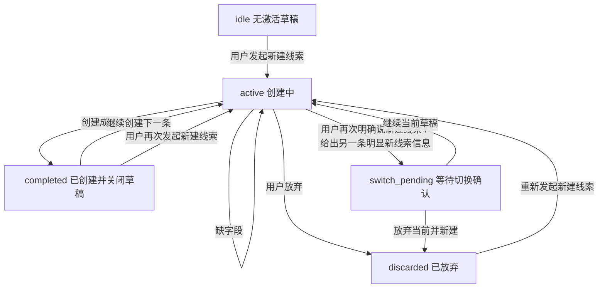

# 1.1 AI 新建线索 Skill 会话状态与按钮交互方案

> 版本：v1.0  
> 日期：2026-06-04  
> 文档类型：Skill Spec / 交互方案  
> 适用范围：`AI 新建线索 Skill` 与右侧 AI 助手对话面板

---

## 1. 文档目标

这份文档只解决一个问题：

**AI 助手在连续创建多条线索时，如何避免上一条线索草稿和下一条线索内容混在一起。**

本文档重点定义：

- 创建线索会话怎么开始
- 创建线索会话什么时候必须关闭
- 缺字段时应该怎么继续补充
- 用户想开始下一条线索时如何切换
- 对话里应该返回哪些按钮
- 哪些规则必须放在 `lead_creation skill`，不能只靠模型理解

---

## 2. 当前问题

当前问题不是“聊天太长”，而是“线索创建会话边界不清楚”。

典型表现：

1. 上一条线索已经创建完成，但草稿上下文还在继续被复用
2. 上一条线索还没完成，用户又开始说“新建线索”，系统没有明确切换
3. 缺字段时，系统只强调“放弃”，但主路径其实应该是“继续补充”
4. 聊天历史和业务草稿没有分清，导致旧信息继续污染新创建

---

## 3. 核心结论

### 3.1 一次线索创建 = 一次独立会话

每创建一条线索，都应该对应一次独立的创建会话。

### 3.2 同一时刻只允许一个 active 草稿

系统在任意时刻，只允许存在一个“正在创建中的线索草稿”参与后续补字段。

### 3.3 创建成功后，草稿必须立即关闭

这是本次最重要的规则之一。

一旦线索创建成功：

- 当前草稿状态必须变为 `completed`
- 当前运行态中的“草稿箱”必须关闭
- 后续用户再说 `王五`、`18935562354` 这类裸信息，**不能**再补到刚刚创建成功的那条线索上

也就是说：

**创建成功 = 当前草稿立即失效，不再可继续补充。**

### 3.4 缺字段时，主动作不是“放弃”，而是“继续补充”

当系统识别到：

- 当前正在创建线索
- 但还缺公司名称、联系人姓名、手机号等必要字段

此时系统应该把主路径定义成：

**请继续补充缺失字段**

而不是优先引导用户放弃。

`放弃本次创建` 可以保留，但它只能是次级动作，不应该是缺字段场景下的主按钮。

### 3.5 聊天历史可以保留，但旧草稿不能继续生效

前面的聊天消息可以继续展示给用户看，但业务逻辑上：

- `completed` 草稿不能复用
- `discarded` 草稿不能复用
- 只有 `active` 草稿能继续接收补字段

---

## 4. 会话状态模型

建议 `AI 新建线索 Skill` 采用以下状态模型：

| 状态 | 含义 | 是否允许继续补字段 |
|------|------|--------------------|
| `idle` | 当前没有激活中的创建草稿 | 否 |
| `active` | 当前有一条正在创建中的草稿 | 是 |
| `switch_pending` | 当前草稿未完成，但用户疑似要开始另一条 | 暂不允许，等待确认 |
| `completed` | 当前草稿已成功创建为正式线索 | 否 |
| `discarded` | 当前草稿已被主动放弃 | 否 |

说明：

- `idle` 可以不必真的落库成一条 session 记录，它表示“当前没有 active 草稿”
- `completed` 和 `discarded` 是终态，只用于记录和展示，不允许再复用

---

## 5. 状态流转

---

## 6. 关键业务规则

### 6.1 创建成功自动关闭草稿

当 `lead_creation skill` 返回 `success` 时，必须同时完成以下动作：

1. 将当前 session 状态写成 `completed`
2. 清空该会话的运行态草稿
3. 前端清掉当前持有的 `session_id`
4. 聊天面板后续不能再把这条 `session_id` 带给下一轮创建

这条规则必须同时在：

- 后端 skill
- assistant 路由
- 前端聊天面板

三个层面保持一致。

### 6.2 缺字段时继续追问，不关闭草稿

当返回 `missing_fields` 时：

- session 保持 `active`
- 当前草稿继续保留
- 助手回复应明确告诉用户缺什么
- 主引导是让用户继续补充

示例回复：

`创建线索还缺少必要信息，请继续补充：联系人姓名、手机号。`

### 6.3 当前有 active 草稿时，再次说“新建线索”不能直接混

如果当前已经有一条 `active` 草稿，用户又明确表达：

- `新建线索`
- `再建一个线索`
- `重新创建一条`

系统不能直接把这句话并入当前草稿。

应进入 `switch_pending`，并提示用户选择：

- `继续当前草稿`
- `放弃当前并新建`

### 6.4 completed 后再说“新建线索”应直接开新会话

如果上一条线索已经 `completed`，此时用户再说：

- `新建线索`
- `创建一个线索`

系统应该直接开启一条新的 `active` 会话。

此时不需要再问“是否继续当前草稿”，因为当前草稿已经结束。

### 6.5 discarded 后旧信息彻底失效

如果用户放弃了当前草稿：

- 当前 session 状态改成 `discarded`
- 该草稿中的公司名、联系人、手机号等信息全部失效
- 后续如果要新建，必须重新开始

---

## 7. 对话按钮设计

## 7.1 缺字段场景

目标：

- 强调“继续补充”是主路径
- `放弃` 只是次级动作

推荐交互：

- 主文案：`创建线索还缺少必要信息，请继续补充：xxx`
- 按钮：
  - `继续补充`
  - `放弃本次创建`

说明：

- `继续补充` 可以不一定调用后端动作，它更多是一个 UI 引导按钮，用于聚焦输入框、提示用户往下补
- `放弃本次创建` 才需要实际调用 discard 接口

## 7.2 查重场景

推荐按钮：

- `查看已有线索`
- `放弃本次创建`

## 7.3 创建成功场景

推荐按钮：

- `查看线索`
- `继续创建下一条`

说明：

- `查看线索`：跳转详情页
- `继续创建下一条`：开启一个全新的创建会话，不复用上一条

## 7.4 疑似切换新线索场景

推荐按钮：

- `继续当前草稿`
- `放弃当前并新建`

说明：

- 这是防止“前一条没关掉，后一条又进来”的关键按钮组

---

## 8. 推荐返回动作定义

建议 `available_actions` 统一使用下面这些动作：

| kind | label | 用途 |
|------|-------|------|
| `focus_continue_fill` | `继续补充` | 缺字段时引导用户继续输入 |
| `discard_creation` | `放弃本次创建` | 放弃当前 active 草稿 |
| `view_duplicate_lead` | `查看已有线索` | 查重时查看重复线索 |
| `view_created_lead` | `查看线索` | 创建成功后查看刚创建的线索 |
| `start_next_creation` | `继续创建下一条` | 创建成功后开启新会话 |
| `continue_current_creation` | `继续当前草稿` | switch_pending 时继续旧草稿 |
| `discard_and_restart_creation` | `放弃当前并新建` | switch_pending 时丢弃旧草稿并开始新草稿 |

---

## 9. 前后端职责划分

### 9.1 `lead_creation skill` 负责

- 管理创建线索会话状态
- 合并当前 active 草稿
- 在 `success` 后关闭草稿
- 在 `missing_fields` 时保持草稿继续有效
- 识别“当前草稿未完，但用户疑似要开新线索”
- 返回 `available_actions`

### 9.2 assistant 路由负责

- 将对话识别结果路由到 `lead_creation skill`
- 处理按钮动作对应的确认或接口调用
- 将 skill 返回结果包装成助手消息

### 9.3 前端聊天面板负责

- 在对应消息下渲染按钮
- 创建成功后清掉本地 `session_id`
- 放弃后清掉本地 `session_id`
- `继续创建下一条` 时显式开启新会话
- 保留聊天展示，但不复用已结束草稿

---

## 10. 推荐交互文案

### 10.1 缺字段

`创建线索还缺少必要信息，请继续补充：联系人姓名、手机号。`

### 10.2 查重

`我发现这条线索可能已经存在。你可以先查看已有线索，再决定是否放弃本次创建。`

### 10.3 创建成功

`已为你创建线索：华北科技。`

### 10.4 疑似切换

`你当前还有一条线索草稿未完成。请确认是继续当前草稿，还是放弃当前并新建下一条。`

### 10.5 未理解

`我没有理解您的意思，请您说完整一点。`

---

## 11. 验收标准

### 11.1 创建成功后不串

场景：

1. 用户创建线索 A 成功
2. 紧接着发送 `王五`

期望：

- 不应再补到线索 A
- 系统应提示重新发起创建，或要求用户明确说明意图

### 11.2 缺字段时可连续补充

场景：

1. 用户说 `创建线索，公司叫华北科技`
2. 系统提示缺联系人姓名和手机号
3. 用户继续说 `王五`
4. 用户继续说 `18935562354`

期望：

- 三轮都落在同一条 active 草稿中
- 不新开会话
- 字段补齐后创建成功

### 11.3 active 草稿未结束时，开始新线索需确认

场景：

1. 用户正在创建线索 A，尚未完成
2. 用户又说 `新建线索，公司叫南城科技`

期望：

- 系统不直接把 `南城科技` 合并进 A
- 系统进入 `switch_pending`
- 返回 `继续当前草稿 / 放弃当前并新建`

### 11.4 completed 后可直接建下一条

场景：

1. 用户创建线索 A 成功
2. 用户点击 `继续创建下一条`

期望：

- 开启全新的 active 会话
- 不带入线索 A 的任何草稿信息

---

## 12. 本文档最终结论

这次方案的核心不是“删聊天记录”，而是：

**让 `AI 新建线索 Skill` 真正具备明确的会话边界。**

最终必须落成这 4 条硬规则：

1. 创建成功后，草稿立即关闭
2. 缺字段时，主路径是继续补充，不是放弃
3. 当前草稿未结束时，用户再开新线索必须先确认切换
4. 聊天历史可以保留，但只有 active 草稿能继续参与创建

只有这样，连续创建多条线索时，上一条和下一条才不会再混在一起。
