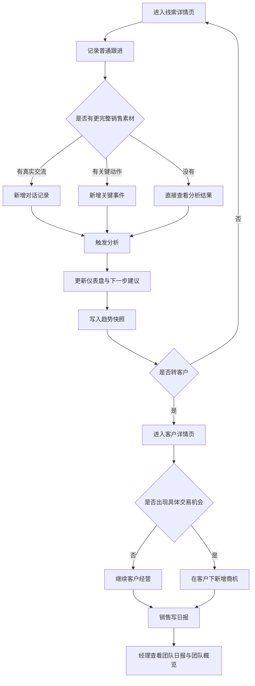
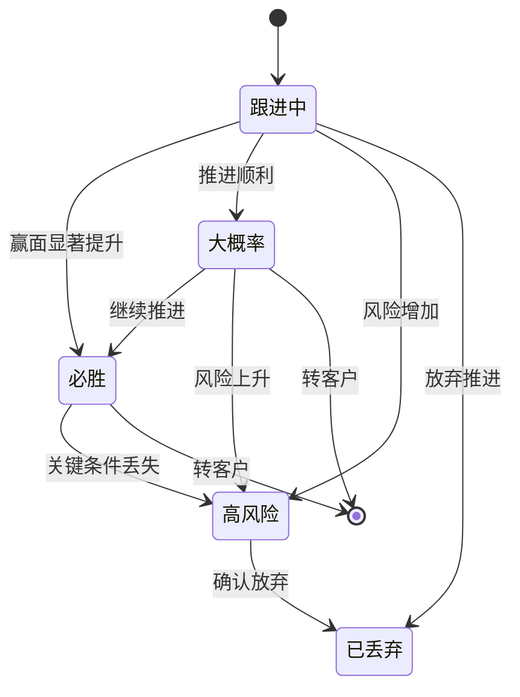

# 1.1 销售分析、客户商机与日报团队视图 PRD
> **版本**：v1.0 | **日期**：2026-06-04 | **作者**：Codex

---

## 一句话说明白
在 1.0 已有线索、公海、客户主链路基础上，补齐线索分析、客户商机、个人日报和团队视图，让系统从“能记录流程”升级到“能支持销售推进与团队管理”。

---

## 1. 背景与问题
### 现状是什么
当前 `AI-CRM` 已经具备以下基础能力：
- 线索创建、编辑、领取、分配、退回公海
- 线索详情跟进
- 线索转客户
- 客户详情维护
- AI 助手辅助部分操作

这套能力已经能跑通“线索进入 -> 跟进 -> 转客户”的主链路，但 1.0 之后有 3 类明显缺口：

1. **线索缺少分析层**
- 线索详情页能记录信息，但不能快速判断这条线索是否清楚、风险在哪、下一步该问什么
- 跟进记录是平铺文本，缺少结构化销售证据
- 销售经理抽查线索时，很难快速判断推进质量

2. **客户缺少商机层**
- 客户详情页能管理客户主体，但缺少承接具体交易机会的对象
- 一旦一个客户后续出现多个项目，系统没有“商机”容器承接
- 客户跟进、拜访记录、沟通纪要后续容易混在一起

3. **管理缺少日报与团队视图**
- 销售每日工作没有系统内沉淀
- 经理看不到谁写了日报、谁没写
- 经理没有统一入口看团队线索盘子和高风险线索
- 当前线索状态不够业务化，不能直接体现赢面和风险

### 为什么现在要做
1.0 解决的是“把业务主链路跑通”，1.1 要解决的是“让这套链路更像一个可以管理的 CRM”。

这次 1.1 的价值主要有 4 个：
- 让线索详情页从“记录页”升级成“分析页”
- 让客户详情页具备后续承接具体生意的能力
- 让销售的日常动作在系统内沉淀成日报
- 让经理拥有团队执行、进展、风险的统一视图

---

## 2. 目标

### 做成什么样
- 目标 1：在线索详情页新增销售分析增强区，包含仪表盘、对话记录、趋势、关键事件
- 目标 2：明确客户与商机关系，并在后续客户详情页中承接商机模块
- 目标 3：新增“我的日报”和“团队日报”
- 目标 4：新增“团队概览”和“团队线索”
- 目标 5：将线索状态升级为更符合业务判断的一层统一状态模型

### 怎么衡量成功

| 指标 | 当前值 | 目标值 | 说明 |
|------|--------|--------|------|
| 线索详情分析区覆盖度 | 0 | 4 个模块全部上线 | 仪表盘、对话记录、趋势、关键事件均可用 |
| 销售分析结果可读性 | 无 | 详情页可直接读懂当前状态 | 用户进入详情页可快速知道缺什么、下一步做什么 |
| 销售素材结构化入口 | 仅跟进记录 | 新增 2 类 | 新增对话记录、关键事件 |
| 趋势可追踪性 | 无 | 支持近 30 天分析趋势 | 至少可看到每次分析后的快照变化 |
| 我的日报可用性 | 0 | 可新建、可查看列表 | 销售能直接在系统内写日报 |
| 团队日报可见性 | 0 | 可按天查看完成情况 | 经理能看到谁已写、谁未写 |
| 团队管理可见性 | 0 | 至少 1 个团队概览页 + 1 个团队线索页 | 支持经理日常管理 |
| 商机归属清晰度 | 不明确 | 明确为客户下对象 | 不再出现归属歧义 |

### 不做什么
- 不做完整大型 `Pipeline（商机管道）`
- 不做经理商机大看板
- 不做复杂 `Forecast（预测）`
- 不做 AI 自动代写日报
- 不做复杂绩效考核和奖金计算
- 不做多级日报审批流
- 不做线索直接转商机

---

## 3. 用户与场景
### 目标用户

| 用户角色 | 特征描述 | 核心诉求 |
|----------|----------|----------|
| 销售 | 每天持续跟进线索和客户 | 想知道线索缺什么、下一步怎么推进，也需要方便写日报 |
| 销售经理 | 负责团队执行和风险管理 | 想看团队成员执行情况、线索风险和整体盘子 |
| 系统管理员 | 负责系统维护与权限 | 需要对象关系和权限边界清晰 |

### 核心使用场景

**场景 1：销售刚跟客户聊完，想沉淀真实交流**
> 销售不想只写一句模糊摘要，而是希望把更接近原话的交流内容沉淀进系统，让系统后续可以分析客户到底说了什么。

**场景 2：销售进入某条线索详情，想快速判断这单现在缺什么**
> 销售不想一条条翻历史记录，而是想直接看到哪些关键信息已经掌握、哪些还没掌握、下一步最该补哪一块。

**场景 3：客户转化后，又出现新的项目机会**
> 客户转化后，销售继续经营这个客户；当后续出现新的项目或采购机会时，需要一个“商机”对象来承接，而不是继续混在线索或客户通用记录里。

**场景 4：销售下班前写日报**
> 销售希望在系统里写一份当天日报，沉淀今天做了什么、推进到哪、遇到什么问题、明天准备做什么。

**场景 5：经理第二天查看团队执行与风险**
> 经理想快速知道昨天谁写了日报、谁没写，以及团队盘子里有哪些高风险线索、哪些线索接近成交。

---

## 4. 核心业务判断

### 4.1 线索、客户、商机三层关系
推荐关系如下：

`Lead（线索） -> Customer（客户） -> Opportunity（商机）`

三者职责：
- `Lead（线索）`：判断这个对象值不值得继续跟
- `Customer（客户）`：确认主体已经成立，进入长期经营
- `Opportunity（商机）`：承接某次具体交易机会，比如某个项目、某次采购、某笔单子

### 4.2 商机归属结论
1. 不在线索下新增正式商机对象
2. 不做“线索直接转商机”主流程
3. 商机只挂在客户下面
4. 一个客户可以有多个商机
5. 线索阶段重点解决“分析和判断值不值得转客户”
6. 客户阶段重点解决“经营主体与推进具体交易机会”

### 4.3 线索状态结论
线索不再采用“主状态 + 成交把握度”双层设计，改为一层统一状态。

推荐状态直接使用：
- 跟进中
- 必胜
- 大概率
- 高风险
- 已丢弃

补充说明：
- `必胜 / 大概率 / 高风险` 都是不同强弱的推进状态
- `已丢弃` 表示该线索已放弃继续推进
- “转客户”不是普通状态枚举，而是对象关系变化，转客户后线索不再作为日常活跃线索管理

### 4.4 团队与公共线索口径
- 团队：一个经理对应的一组销售成员
- 团队线索：当前 `owner` 属于该团队成员的线索
- 公共线索：尚未归属具体销售的共享线索，不计入团队线索
- 大区：线索的业务归属区域，作为筛选维度，不直接等同于团队

---

## 5. 整体流程

本次 1.1 的主脉路分 3 段：
1. 线索侧分析增强
2. 客户侧商机承接
3. 管理侧日报与团队视图





---

## 6. 需求详述

### 6.1 线索详情页销售分析增强区

**做什么**：在线索详情页现有“基础信息 + 联系人 + 跟进记录”下面，新增一个“销售分析增强区”，包含 4 个模块：仪表盘、对话记录、趋势、关键事件。

**业务规则**：
1. 不重做现有基础信息区、联系人区、跟进记录区，只在下方追加新模块
2. 新增分析区仅在线索详情页出现
3. 页面主入口仍然是现有 `/leads/{id}` 详情页，不新增独立路由
4. 已转客户或已丢弃线索仍可查看历史分析区，但限制与状态冲突的编辑动作

**页面布局**：
```text
+----------------------------------------------------------------------------------+
| 线索详情：某企业                                                             [返回] |
+----------------------------------------------------------------------------------+
| 基础信息区                                                                       |
+----------------------------------------------------------------------------------+
| 联系人区                                                                         |
+----------------------------------------------------------------------------------+
| 跟进记录区                                                                       |
+----------------------------------------------------------------------------------+
| 销售分析增强区                                                                   |
|  +--------------------------------------------------------------------------+   |
|  | 1. 仪表盘                                                               |   |
|  +--------------------------------------------------------------------------+   |
|  | 2. 对话记录                                                             |   |
|  +--------------------------------------------------------------------------+   |
|  | 3. 趋势                                                                 |   |
|  +--------------------------------------------------------------------------+   |
|  | 4. 关键事件                                                             |   |
|  +--------------------------------------------------------------------------+   |
+----------------------------------------------------------------------------------+
```

**验收标准**：
- [ ] 线索详情页保留现有能力
- [ ] 跟进记录区下方新增独立的销售分析增强区
- [ ] 4 个模块都在同一详情页内可见

---

### 6.2 模块一：销售分析仪表盘

**做什么**：展示线索当前的信息完整度、关键证据覆盖情况和下一步建议。

**业务规则**：
1. 仪表盘用于回答“这条线索当前清不清楚、还缺什么”，不是成交概率预测页
2. 至少包含：总分、完成度、维度卡片、下一步建议、重新分析入口
3. 第一版采用固定 7 个分析维度，不支持后台自定义
4. 第一版沿用 `MEDDICC（销售资格判断方法）` 思路，但页面优先用中文解释
5. 每个维度显示：是否点亮、证据条数、示例证据
6. 没有分析数据时显示空状态和引导文案

**建议的 7 个维度**：
1. 量化目标
2. 拍板人
3. 决策标准
4. 决策流程
5. 核心痛点
6. 内部支持者
7. 竞争情况

**异常与边界**：

| 异常情况 | 系统行为 | 用户看到什么 |
|----------|----------|------------|
| 当前线索没有可分析材料 | 返回空状态 | 提示先录入对话记录或关键事件 |
| 分析失败 | 保留上次成功结果 | 提示本次分析失败，可稍后重试 |
| 材料很少 | 正常输出低分结果 | 用户看到“当前信息不足” |

**验收标准**：
- [ ] 可展示总分、完成度、上次分析时间
- [ ] 7 个维度均有固定展示位
- [ ] 每个维度支持展示点亮状态和证据条数
- [ ] 支持手动重新分析

---

### 6.3 模块二：对话记录

**做什么**：保存更接近原始交流内容的销售对话文本，作为分析的重要材料。

**业务规则**：
1. 对话记录和现有“跟进记录”不是一回事
2. 跟进记录保留为简要摘要；对话记录用于保存更完整的客户交流文本
3. 第一版支持手动新增、查看、删除
4. 第一版不做语音转写、文件上传、自动会议纪要导入
5. 每条对话记录至少包括：内容、记录时间、来源类型、创建人
6. 新增或删除对话记录后，应触发一次分析刷新

**验收标准**：
- [ ] 支持新增对话记录
- [ ] 支持查看历史对话记录
- [ ] 支持删除对话记录
- [ ] 新增或删除后会刷新分析结果

---

### 6.4 模块三：趋势

**做什么**：展示线索分析分数在一段时间内的变化趋势。

**业务规则**：
1. 趋势图展示的是“分析分数变化”，不是销售额，也不是成交概率
2. 第一版默认展示近 30 天趋势
3. 每次成功分析后写入一个快照点
4. 快照至少包括：线索 ID、分析时间、分数、完成度
5. 若快照点少于 2 个，则显示空态或提示“暂无趋势数据”

**验收标准**：
- [ ] 每次分析成功后会写入趋势快照
- [ ] 详情页可展示近 30 天分数趋势
- [ ] 数据不足时有明确空状态

---

### 6.5 模块四：关键事件

**做什么**：用结构化方式记录销售过程中的重要里程碑动作。

**建议首批事件类型**：
- 拜访关键人
- 方案演示 / Demo
- 报价 / 提案已发
- 内部立项 / 进入采购
- 发现内部支持者
- 明确竞品

**业务规则**：
1. 第一版关键事件类型固定，不支持自定义
2. 每条关键事件至少包括：事件类型、发生时间、备注、创建人
3. 新增关键事件后应参与分析
4. 第一版支持新增和列表查看；删除和编辑可后续补

**验收标准**：
- [ ] 支持新增关键事件
- [ ] 关键事件可结构化展示
- [ ] 新增关键事件后可参与分析

---

### 6.6 分析触发与数据来源边界

**分析输入来源**：
- 线索基础信息
- 现有跟进记录
- 新增对话记录
- 新增关键事件

**第一版触发时机**：
- 新增对话记录后
- 删除对话记录后
- 新增关键事件后
- 用户手动点击重新分析

**边界规则**：
1. 第一版不要求“新增普通跟进记录后自动触发分析”
2. 分析结果需要持久化
3. 分析快照与当前结果分开存储：当前结果服务仪表盘，快照服务趋势

**验收标准**：
- [ ] 分析输入来源边界清晰
- [ ] 分析结果支持持久化
- [ ] 趋势快照与当前结果分离

---

### 6.7 客户与商机关系

**做什么**：明确客户与商机的关系，并为后续客户详情页扩展打基础。

**业务规则**：
1. 客户详情页后续应增加“商机”模块
2. 商机不属于线索详情页，而属于客户详情页
3. 一个客户可以有多个商机
4. 转客户成功后，可以提示“是否创建首个商机”，但不是强制

**商机基础字段建议**：
- 商机名称
- 商机金额
- 当前阶段
- 预计成交日期
- 负责人
- 来源线索 ID
- 备注
- 状态：进行中 / 赢单 / 输单

**客户经营记录与商机关系**：
后续这些记录应支持“可选关联某个商机”：
- 客户跟进
- 拜访记录
- 沟通纪要

建议预留字段：
- `customer_followup.opportunity_id`
- `visit_record.opportunity_id`
- `communication_note.opportunity_id`

**验收标准**：
- [ ] 明确商机是客户下对象
- [ ] 明确一个客户可有多个商机
- [ ] 明确不做“线索直接转商机”主流程

---

### 6.8 我的日报

**做什么**：给销售提供一个“我的日报”页面，支持查看日报列表和新增当天日报。

**业务规则**：
1. 销售默认只看自己的日报
2. 第一版以“列表 + 新增”为主，不做复杂审批流
3. 推荐规则是一人一天一份日报；当天已存在时，进入后应更新当天日报，而不是重复新增
4. 日报至少包含：日期、今日工作内容、今日进展/结果、遇到的问题、明日计划
5. 第一版不做附件上传，不做自动提醒，不做自动生成

**异常与边界**：

| 异常情况 | 系统行为 | 用户看到什么 |
|----------|----------|------------|
| 当天已写日报 | 打开当天日报更新 | 提示今天已存在日报 |
| 关键字段为空 | 不允许保存 | 提示补全必填内容 |
| 没有历史日报 | 显示空态 | 提示暂无日报并引导新增 |

**验收标准**：
- [ ] 销售可新增当天日报
- [ ] 销售可查看自己的日报列表
- [ ] 同一天不会重复生成多份日报

---

### 6.9 团队日报

**做什么**：给销售经理提供“团队日报”页面，用于查看团队成员日报及每日完成情况。

**业务规则**：
1. 仅销售经理和系统管理员可见
2. 经理默认查看自己管理团队的日报
3. 不仅显示“已写的人”，还要能显示“未写的人”
4. 至少支持按团队、日期、成员、完成状态筛选
5. 第一版不做点评、评分、审批通过/驳回

**验收标准**：
- [ ] 经理可查看团队日报列表
- [ ] 支持按团队、日期、成员、状态筛选
- [ ] 可清楚看到谁已写、谁未写

---

### 6.10 线索统一状态模型

**做什么**：把原来“主状态 + 成交把握度”两层设计，收敛成一层更直接的业务状态。

**推荐状态**：
- 跟进中
- 必胜
- 大概率
- 高风险
- 已丢弃

**业务规则**：
1. 线索状态直接表达当前推进与风险
2. 不再单独维护“成交把握度”字段
3. 状态同时承担展示、筛选、管理用途
4. `必胜 / 大概率 / 高风险` 本质上都属于不同强弱的推进状态，但页面和字段层面直接作为正式状态使用
5. `已丢弃` 用于表达该线索已放弃继续推进
6. 转客户不是普通状态切换，而是对象关系变化

**验收标准**：
- [ ] 不再引入独立的成交把握度字段
- [ ] 线索使用统一状态模型
- [ ] 我的线索、团队线索、线索详情页都按统一状态展示
- [ ] 支持按统一状态筛选

---

### 6.11 团队概览

**做什么**：提供一个面向销售经理的“团队概览”页面，用来查看团队整体盘子、状态分布和高风险情况。

**建议展示**：
- 团队总线索数
- 跟进中数量
- 必胜数量
- 大概率数量
- 高风险数量
- 已丢弃数量
- 今日日报完成数
- 成员总体情况

**业务规则**：
1. “团队概览”比“我的团队”更适合作为页面名
2. 页面顶部支持选择团队
3. 页面需要展示整体统计，而不只是单条线索列表
4. 第一版不做绩效打分和奖金计算

**验收标准**：
- [ ] 经理可进入团队概览页
- [ ] 支持团队切换
- [ ] 可看到线索状态分布和高风险情况
- [ ] 可看到成员总体情况

---

### 6.12 团队线索

**做什么**：给销售经理提供“团队线索”页面，用来查看管理范围内成员持有的线索列表。

**业务规则**：
1. 仅销售经理和系统管理员可见
2. 团队线索默认显示“当前 owner 属于该团队成员”的线索
3. 团队线索不等于公共线索池
4. 公共线索继续留在“公共线索池”页面，不自动算进团队线索
5. 至少支持按团队、成员、大区、状态筛选
6. 第一版主要是查看和筛选入口，具体跟进仍回到线索详情页

**验收标准**：
- [ ] 经理可查看团队线索列表
- [ ] 支持按团队、成员、大区、状态筛选
- [ ] 列表可看到负责人和状态
- [ ] 可从团队线索进入线索详情页

---

### 6.13 团队口径与权限规则

**团队定义建议**：
- 团队：一个经理对应的一组销售成员
- 大区：线索的业务归属区域，如华东、华北
- 团队线索：当前负责人属于该团队的线索
- 公共线索：尚未归属具体销售的共享线索，不计入团队线索

**权限建议**：
1. 销售只看自己的日报和自己的线索
2. 销售经理可看自己管理范围内的团队日报、团队线索和团队概览
3. 系统管理员可看全部团队

**验收标准**：
- [ ] 团队、团队线索、公共线索口径不冲突
- [ ] 销售、经理、管理员权限边界清晰
- [ ] 团队日报和团队线索都能基于同一团队口径取数

---

## 7. 页面清单

| 页面名称 | 现状 | 1.1 结论 |
|----------|------|----------|
| 线索详情页 | 已有 | 新增销售分析增强区 |
| 客户详情页 | 已有 | 后续应新增商机模块 |
| 我的日报 | 无 | 新增 |
| 团队日报 | 无 | 新增 |
| 团队概览 | 无 | 新增 |
| 团队线索 | 无 | 新增 |
| 商机独立总览页 | 无 | 本次不做 |
| 经理商机看板 | 无 | 本次不做 |

---

## 8. 数据对象与字段建议

### 8.1 线索分析增强新增对象

| 对象 | 用途 |
|------|------|
| LeadConversation | 记录线索对话文本 |
| LeadKeyEvent | 记录线索关键事件 |
| LeadAnalysisCurrent | 存当前线索分析结果 |
| LeadAnalysisSnapshot | 存线索分析历史快照 |

### 8.2 商机对象建议

| 对象 | 用途 |
|------|------|
| Opportunity | 存客户下商机 |

### 8.3 日报与团队视图对象建议

| 对象/字段 | 用途 |
|-----------|------|
| DailyReport | 存个人日报 |
| team_id 或团队成员关系表 | 支持团队切换与团队权限 |
| lead.status | 存线索统一状态 |
| 团队日报统计接口 | 支持已完成/未完成名单 |
| 团队概览统计接口 | 支持分布和成员总体情况 |

### 8.4 预留关联字段建议

| 对象 | 预留字段 | 说明 |
|------|----------|------|
| CustomerFollowUp | opportunity_id | 某条客户跟进可选关联某个商机 |
| VisitRecord | opportunity_id | 某条拜访记录可选关联某个商机 |
| CommunicationNote | opportunity_id | 某条沟通纪要可选关联某个商机 |

---

## 9. 开放问题与风险

| # | 问题/风险 | 影响 | 当前状态 | 负责人 |
|---|----------|------|---------|--------|
| 1 | 页面上是否直接叫 `MEDDICC`，还是包装成“销售分析” | 影响用户理解成本 | 待确认 | 产品 |
| 2 | 分析逻辑是规则优先、模型优先，还是规则 + 模型混合 | 影响后端实现复杂度 | 待确认 | 产品/研发 |
| 3 | 关键事件首批类型是否固定为 6 类 | 影响表结构与前端表单 | 待确认 | 产品 |
| 4 | 转客户后是否立即弹出“创建首个商机”引导 | 影响流程连贯性 | 待确认 | 产品 |
| 5 | 商机阶段首批枚举怎么定 | 影响后续商机列表可用性 | 待确认 | 产品 |
| 6 | 客户经营记录第一版是否要强制绑定商机 | 影响表单复杂度 | 当前建议不强制 | 产品 |
| 7 | 系统当前是否已有明确团队数据结构 | 影响团队日报与团队线索实现 | 待确认 | 研发 |
| 8 | 团队定义按直属经理还是按大区 | 影响团队口径 | 当前建议以直属团队为主 | 产品 |
| 9 | 线索状态是否只允许在详情页修改 | 影响交互复杂度 | 待确认 | 产品 |
| 10 | 高风险是否必须填写原因说明 | 影响数据质量与表单复杂度 | 待确认 | 产品 |
| 11 | 日报是否允许补写历史日期 | 影响日报口径 | 当前建议允许，但需标记日期 | 产品 |

---

## 10. 推荐实施顺序
1. 先完成线索详情页四模块结构
2. 打通对话记录与关键事件录入
3. 打通分析结果与趋势快照
4. 完成线索分析增强闭环
5. 将线索状态切换到统一状态模型
6. 新增我的日报与团队日报
7. 新增团队概览与团队线索
8. 最后再进入客户详情页轻量版商机模块
