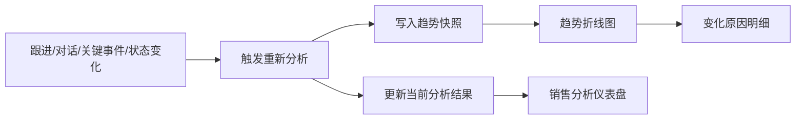

# 1.1.1 线索分析趋势详细方案
> **版本**：V1.0  
> **日期**：2026-06-04  
> **范围**：仅针对“我的线索 -> 线索详情 -> 分析趋势”及其背后的评分与快照机制

---

## 一句话说明
把当前“分析趋势”的列表式展示，升级为“事件驱动的线索健康度折线图 + 变化原因解释”，让销售和经理看得懂线索是在升温还是降温、为什么变、下一步该做什么。

---

## 1. 为什么要做这次 1.1.1

### 1.1 当前现状
当前项目已经有线索分析的基础能力：

- 后端已有 `LeadAnalysisCurrent` 和 `LeadAnalysisSnapshot`
- 后端已有 `rebuild_lead_analysis()` 规则打分逻辑
- 线索详情页已有 4 个分析模块：
  - 销售分析仪表盘
  - 对话记录
  - 分析趋势
  - 关键事件

对应代码位置：

- 后端评分与快照：[services.py](/abs/path/C:/Users/Administrator/AI编程/AICRM/AI-CRM/src/backend/app/services.py:407)
- 线索分析接口：[leads.py](/abs/path/C:/Users/Administrator/AI编程/AICRM/AI-CRM/src/backend/app/routers/leads.py:376)
- 当前趋势前端组件：[lead-analysis-trend.tsx](/abs/path/C:/Users/Administrator/AI编程/AICRM/AI-CRM/src/frontend/src/components/leads/lead-analysis-trend.tsx:1)
- 当前线索详情页：[page.tsx](</abs/path/C:/Users/Administrator/AI编程/AICRM/AI-CRM/src/frontend/src/app/(authenticated)/leads/[id]/page.tsx:1>)

### 1.2 当前存在的实际问题
你截图里看到的问题，本质上有 5 个：

1. `分析趋势` 现在不是图，而是一组时间列表，销售看不出走势。
2. 当前快照是“每次重算就追加一条”，所以容易出现同一天很多重复点，看不出重点。
3. 当前趋势只体现“分析结果被重算过”，没有体现“为什么升分/降分”。
4. 当前后端虽然在计算时会读取 `LeadFollowUp`，但 `新增跟进` 并不会自动触发重算，所以跟进并没有真正进入趋势闭环。
5. 当前趋势数据结构太薄，只有：
   - `score`
   - `completed_dimension_count`
   - `total_dimension_count`
   - `analyzed_at`

缺少：

- 本次是谁触发的趋势变化
- 本次分数变化了多少
- 哪些维度被点亮/熄灭
- 为什么变化

### 1.3 业务判断
先进一点的 CRM 或销售分析产品，趋势图不是“历史记录列表”，而是“线索势能曲线”。

它回答的不是：

- 这条线索做过哪些记录

而是：

- 这条线索现在是升温还是降温
- 这次变化是谁触发的
- 是新增跟进起作用，还是关键事件起作用
- 是信息更完整了，还是长时间没跟进导致降温
- 下一步最应该补什么

---

## 2. 本次目标

### 2.1 做成什么样

- 目标 1：把 `分析趋势` 从列表改成真正的折线图
- 目标 2：让 `新增跟进 / 对话记录 / 关键事件 / 线索状态变化 / 线索基础信息变化` 都能影响趋势
- 目标 3：每个趋势点都能解释“为什么变化”
- 目标 4：避免无意义重复快照，减少同一天一堆相同点
- 目标 5：不推翻现有 7 维分析框架，而是在现有基础上增强

### 2.2 本次不做什么

- 不在本次把“客户详情页的拜访记录/沟通纪要/商机”混进线索趋势
- 不做 AI 大模型单独判分服务
- 不做完整 BI 图表系统
- 不做跨客户、跨商机的统一经营趋势

说明：
线索趋势只覆盖 `Lead` 阶段。客户与商机阶段如果后续要看趋势，应单独做 `客户经营趋势` 或 `商机推进趋势`，不要硬塞进线索趋势。

---

## 3. 结合当前项目的设计结论

### 3.1 线索趋势的定义
在本项目里，`分析趋势` 定义为：

> 同一条线索在不同时间点被重新分析后，线索健康度分数、维度完成度和变化原因的时间序列。

它不是销售额趋势，不是成交概率图，也不是普通操作日志。

### 3.2 本项目里应该影响趋势的对象

本项目 1.1.1 先纳入以下对象：

1. `Lead` 基础信息
- 公司名称
- 组织机构代码
- 大区
- 负责人
- 状态
- 备注

2. `LeadContact`
- 主联系人
- 联系人数量
- 联系人职位

3. `LeadFollowUp`
- 新增跟进
- 跟进时间
- 下次跟进时间
- 跟进内容

4. `LeadConversation`
- 对话记录
- 对话来源类型
- 对话正文
- 对话时间

5. `LeadKeyEvent`
- 关键事件类型
- 关键事件备注
- 关键事件时间

### 3.3 哪些动作要触发重算

当前系统已经触发的：

- 新增对话记录
- 删除对话记录
- 新增关键事件
- 手动点击“重新分析”

本次 1.1.1 要补齐的：

- 新增线索跟进
- 编辑线索基础信息
- 编辑线索联系人
- 修改线索状态
- 标记已丢弃
- 领取公共线索 / 退回公共池 / 强制收回
- 线索首次进入详情页且无 current 分析结果时

说明：
`新增跟进要影响趋势` 这个点是本次必须修的核心缺口。

---

## 4. 评分方法设计

## 4.1 总体思路
本项目不建议改成完全另一套评分模型，而是在当前 `7 个分析维度 + source bonus` 的规则版基础上，升级成 4 层分数：

### A. 结构化业务维度分：0-70
继续沿用当前 7 个维度，每个维度 10 分：

1. 量化目标
2. 拍板人
3. 决策标准
4. 决策流程
5. 核心痛点
6. 内部支持者
7. 竞争情况

### B. 行为活跃分：0-15
看最近一段时间是否有真实推进动作：

- 最近 7 天有跟进：`+4`
- 最近 7 天有对话记录：`+4`
- 最近 14 天至少有 2 次有效触达：`+4`
- 已设置下次跟进时间：`+3`

### C. 推进里程碑分：0-15
看是否出现明显推进信号：

- 状态为 `大概率赢`：`+4`
- 状态为 `必赢`：`+8`
- 新增正向关键事件：`+4`
- 明确出现 `Demo / 报价 / 审批 / 采购 / 立项`：按规则再给 `+2 ~ +4`

### D. 时效与风险调整：-20 到 0
让线索因为“长时间没推进”而自然降温：

- 7 天无任何跟进/对话/关键事件：`-5`
- 14 天无任何推进动作：`-10`
- 30 天无任何推进动作：`-15`
- 状态为 `高风险`：额外 `-5`
- 状态为 `已丢弃`：直接拉低到低分区间

### 最终公式

```text
总分 = 结构化业务维度分 + 行为活跃分 + 推进里程碑分 + 时效与风险调整
总分最终限制在 0 ~ 100
```

---

## 4.2 维持当前代码可迁移的做法
当前后端已有这段逻辑：

- 7 个维度命中数
- `source_bonus = conversations * 5 + key_events * 5 + followups * 2`
- `score = completed_dimension_count * 10 + source_bonus`

本次不建议一次推倒重写，而建议分两步：

### 第一步：V1.1 可落地版
在现有 `build_lead_analysis_payload()` 基础上增强：

- 继续保留 7 维命中规则
- 把 `source_bonus` 拆成可解释的：
  - 跟进活跃分
  - 对话活跃分
  - 关键事件分
  - 时效扣分
  - 状态调整分

这样既兼容当前代码思路，也能解释为什么变化。

### 第二步：V1.2 再升级
如果后续效果好，再引入：

- 更细的关键词权重
- 正负向事件字典
- AI 一句话总结变化原因

---

## 4.3 事件影响表

| 事件类型 | 是否触发重算 | 主要影响 | 建议分值方向 |
|---|---|---|---|
| 新增线索跟进 | 是 | 活跃度、决策流程、痛点、时效 | `+2 ~ +8` |
| 新增对话记录 | 是 | 7 维业务信息、活跃度 | `+3 ~ +10` |
| 删除对话记录 | 是 | 维度证据减少 | `0 / -分` |
| 新增关键事件 | 是 | 里程碑、状态可信度 | `+4 ~ +12` |
| 编辑基础信息 | 是 | 负责人、区域、组织信息完整度 | `0 / +分` |
| 编辑联系人 | 是 | 主联系人、拍板人、职位判断 | `0 / +分` |
| 状态改为大概率赢 | 是 | 推进里程碑 | `+4` |
| 状态改为必赢 | 是 | 推进里程碑 | `+8` |
| 状态改为高风险 | 是 | 风险调整 | `-5` |
| 标记已丢弃 | 是 | 风险调整 | 降到低分区 |
| 长时间无动作 | 被动触发或重算时体现 | 时效衰减 | `-5 / -10 / -15` |

---

## 5. 快照与趋势数据设计

## 5.1 现有模型复用策略
本项目已经有：

- `LeadAnalysisCurrent`
- `LeadAnalysisSnapshot`

所以 1.1.1 不建议再新建趋势表，而是直接增强现有快照。

### 结论
优先复用：

- `LeadAnalysisCurrent.raw_payload`
- `LeadAnalysisSnapshot.snapshot_payload`

不新增新表。

这样对当前 SQLite + 启动迁移方案最友好。

---

## 5.2 快照需要补充的字段
当前 `LeadAnalysisSnapshot` 对外只序列化了：

- `id`
- `lead_id`
- `score`
- `completed_dimension_count`
- `total_dimension_count`
- `analyzed_at`

本次建议把 `snapshot_payload` 扩展成下面结构：

```json
{
  "dimensions": [
    {
      "code": "decision_process",
      "label": "决策流程",
      "matched": true,
      "evidence_count": 2,
      "evidences": ["营销部门确认后还要 IT 和老板审批"]
    }
  ],
  "source_counts": {
    "followups": 3,
    "conversations": 5,
    "key_events": 2
  },
  "trigger": {
    "type": "followup_created",
    "label": "新增跟进",
    "ref_id": 18
  },
  "delta": {
    "score": 8,
    "completed_dimension_count": 1
  },
  "changes": {
    "added_dimensions": ["decision_process"],
    "removed_dimensions": []
  },
  "reason_codes": [
    "dimension_added.decision_process",
    "activity_refreshed.followup"
  ],
  "reason_summary": "新增跟进中出现审批流程信息，点亮“决策流程”维度，分数上升 8 分。"
}
```

---

## 5.3 对外返回结构建议
把现有 `GET /leads/{lead_id}/analysis/trend` 扩展为：

```json
{
  "items": [
    {
      "id": 12,
      "lead_id": 8,
      "score": 48,
      "completed_dimension_count": 4,
      "total_dimension_count": 7,
      "analyzed_at": "2026-06-04T11:19:42",
      "trigger_type": "followup_created",
      "trigger_label": "新增跟进",
      "score_delta": 8,
      "reason_summary": "新增跟进中补充了审批流程信息，决策流程维度被点亮。",
      "added_dimensions": ["decision_process"],
      "removed_dimensions": [],
      "source_counts": {
        "followups": 3,
        "conversations": 5,
        "key_events": 2
      }
    }
  ],
  "summary": {
    "latest_score": 48,
    "delta_7d": 13,
    "highest_score": 48,
    "lowest_score": 15
  }
}
```

说明：

- 不需要新接口
- 直接扩展现有趋势接口返回内容即可
- 老前端即使暂时只用 `items.score`，也不会被破坏

---

## 5.4 去重与快照写入规则
你截图里同一天重复很多点，根因是“每次重算都 append snapshot”。

本次建议加一层去重规则：

### 快照新增条件
只有满足以下任一条件，才新增趋势点：

1. `score` 变化了
2. `completed_dimension_count` 变化了
3. `added_dimensions / removed_dimensions` 变化了
4. 触发事件属于“关键节点”：
   - 新增关键事件
   - 状态变化
   - 标记已丢弃
   - 手动重新分析

### 快照不新增条件
若以下都没变，则不追加：

- 分数没变
- 完成维度没变
- 变化原因没变
- 距离上次快照很近

这样可以解决“同一天一堆重复点”的问题。

---

## 6. 前端页面方案

## 6.1 页面结构
`分析趋势` 模块建议改成两层：

1. 上层：折线图卡片
2. 下层：变化明细列表

### 页面草图

```text
+----------------------------------------------------------------------------------+
| 分析趋势                                                           [近30天 v]    |
+----------------------------------------------------------------------------------+
| 最新分数 48     7日变化 +13     最高 48     最低 15                               |
|----------------------------------------------------------------------------------|
| 100 |                                                                        o   |
|  75 |                                                               o            |
|  50 |                                                   o----o                   |
|  25 |                                     o----o                                 |
|   0 |____________________o_______________________________________________________|
|       05/20      05/24      05/28      06/01      06/04                          |
|                                                                                  |
|  点位提示：时间 / 分数 / 变化值 / 触发事件 / 变化原因                              |
+----------------------------------------------------------------------------------+
| 变化明细                                                                         |
|  06/04 11:19  +8分   新增跟进    点亮“决策流程”                                  |
|  06/04 11:18  +5分   新增对话    补充“拍板人”为 CEO                               |
|  06/03 17:10  -5分   时效衰减    7天无推进动作                                    |
+----------------------------------------------------------------------------------+
```

---

## 6.2 图表交互规则

### 图表基础

- X 轴：时间
- Y 轴：分数 0-100
- 默认展示近 30 天
- 至少 2 个点才画线
- 0 或 1 个点时展示空状态

### 点位样式

- 分数上升点：绿色描边
- 分数下降点：红色描边
- 分数不变点：蓝色描边
- 不同触发事件可带不同图标或小标签：
  - 跟进
  - 对话
  - 关键事件
  - 状态变化

### Tooltip 内容
鼠标悬停时显示：

- 分析时间
- 当前分数
- 相比上一个点 `+N / -N`
- 触发事件
- 新增或丢失的维度
- 变化原因摘要

---

## 6.3 技术实现建议
当前项目没有图表库。为了控制复杂度，建议：

- 前端直接用 `SVG` 自绘折线图
- 不新增大型依赖

原因：

- 目前趋势图是单线图，不复杂
- 这套项目偏轻量，不适合引入重型图表库
- 自绘 SVG 足够支持：
  - 折线
  - 圆点
  - 网格线
  - hover tooltip

建议改造文件：

- [lead-analysis-trend.tsx](/abs/path/C:/Users/Administrator/AI编程/AICRM/AI-CRM/src/frontend/src/components/leads/lead-analysis-trend.tsx:1)
- [types/index.ts](/abs/path/C:/Users/Administrator/AI编程/AICRM/AI-CRM/src/frontend/src/types/index.ts:103)

---

## 7. 后端改造方案

## 7.1 服务层改造
核心改造点在 [services.py](/abs/path/C:/Users/Administrator/AI编程/AICRM/AI-CRM/src/backend/app/services.py:407)。

### 建议新增或调整的方法

1. `build_lead_analysis_payload(...)`
- 继续返回当前总分与 7 维结果
- 额外返回：
  - `reason_summary`
  - `reason_codes`
  - `changes`
  - `activity_score`
  - `milestone_score`
  - `risk_adjustment`

2. `rebuild_lead_analysis(...)`
- 增加入参：

```python
trigger: dict[str, Any] | None = None
```

- 作用：
  - 让后端知道这次是“谁”触发的重算
  - 方便记录到 snapshot payload

3. `append_lead_analysis_snapshot(...)`
- 写入前先取最后一个 snapshot
- 根据去重规则决定：
  - 追加新点
  - 或跳过

4. `serialize_lead_analysis_snapshot(...)`
- 把 `snapshot_payload` 里的：
  - trigger
  - delta
  - reason_summary
  - changes
  - source_counts
 解析出来返回给前端

---

## 7.2 路由层改造

### 需要补触发的接口

1. `POST /leads/{lead_id}/followups`
- 现在只保存跟进
- 需要补：
  - `session.flush()`
  - `rebuild_lead_analysis(..., trigger=...)`
  - 返回最新分析结果或至少保证趋势已更新

2. `PATCH /leads/{lead_id}`
- 如果修改了会影响分析的字段，应触发重算
- 重点字段：
  - `status`
  - `owner_id`
  - `notes`
  - `contacts`
  - `company_name`
  - `organization_code`
  - `region`

3. `POST /leads/{lead_id}/mark-lost`
- 需要触发重算并打快照

4. `POST /leads/{lead_id}/claim`
5. `POST /leads/{lead_id}/return-to-pool`
6. `POST /leads/{lead_id}/force-reclaim`
- 若负责人变化参与评分，建议也触发

7. `POST /leads/{lead_id}/analysis/rebuild`
- 保留
- 但写入 trigger 为 `manual_rebuild`

---

## 7.3 触发参数建议

后端内部统一传这种结构：

```python
trigger = {
    "type": "followup_created",
    "label": "新增跟进",
    "ref_id": followup.id,
}
```

建议首批 trigger type：

- `followup_created`
- `conversation_created`
- `conversation_deleted`
- `key_event_created`
- `lead_updated`
- `status_changed`
- `lead_marked_lost`
- `lead_claimed`
- `lead_returned_to_pool`
- `manual_rebuild`

---

## 8. 与当前 7 维分析模块的关系

这次不是推翻 `销售分析仪表盘`，而是让 `趋势` 成为仪表盘的时间维度。

### 关系说明

- `仪表盘`：回答“现在是什么状态”
- `趋势图`：回答“状态怎么变成现在这样”
- `对话记录 / 关键事件 / 跟进`：回答“是哪些输入推动了变化”

所以这 4 块应形成闭环：



---

## 9. 前后端字段改造建议

## 9.1 前端类型扩展
当前 [types/index.ts](/abs/path/C:/Users/Administrator/AI编程/AICRM/AI-CRM/src/frontend/src/types/index.ts:103) 里的 `LeadAnalysisTrendPoint` 太简单，建议扩成：

```ts
export interface LeadAnalysisTrendPoint {
  id: number;
  lead_id: number;
  score: number;
  completed_dimension_count: number;
  total_dimension_count: number;
  analyzed_at: string;
  trigger_type?: string;
  trigger_label?: string;
  score_delta?: number;
  reason_summary?: string;
  added_dimensions?: string[];
  removed_dimensions?: string[];
  source_counts?: {
    followups: number;
    conversations: number;
    key_events: number;
  };
}
```

---

## 9.2 后端序列化扩展
当前 [serialize_lead_analysis_snapshot](</abs/path/C:/Users/Administrator/AI编程/AICRM/AI-CRM/src/backend/app/services.py:518>) 只回最基本字段。

建议改为：

- 保留旧字段
- 增加：
  - `trigger_type`
  - `trigger_label`
  - `score_delta`
  - `reason_summary`
  - `added_dimensions`
  - `removed_dimensions`
  - `source_counts`

这样不会破坏兼容性。

---

## 10. 分阶段实施建议

## 第一阶段：可上线版

目标：

- 趋势从列表改成折线图
- 跟进、对话、关键事件、状态变化都能触发趋势更新
- 每个点带 `score_delta` 和 `reason_summary`
- 快照去重

交付点：

- 后端 trigger + delta + reason
- 前端 SVG 折线图
- 下方变化明细

## 第二阶段：增强版

目标：

- Tooltip 更丰富
- 图上增加事件标记
- 7 日变化、30 日变化摘要
- 关键事件类型颜色区分

## 第三阶段：智能解释版

目标：

- AI 一句话总结这次变化
- 推荐下一步动作为什么是它
- 维度证据更自然语言化

---

## 11. 验收标准

### 11.1 页面表现

- [ ] 分析趋势默认展示折线图，而不是纯列表
- [ ] 趋势图可看到 X 轴时间和 Y 轴分数
- [ ] 至少 2 个点时显示连线
- [ ] 0 或 1 个点时显示明确空状态
- [ ] 点位悬停可看到本次分数变化和原因
- [ ] 图下有变化明细列表

### 11.2 数据闭环

- [ ] 新增线索跟进后，趋势会更新
- [ ] 新增对话记录后，趋势会更新
- [ ] 删除对话记录后，趋势会更新
- [ ] 新增关键事件后，趋势会更新
- [ ] 修改线索状态后，趋势会更新
- [ ] 手动重算后，趋势会更新

### 11.3 数据质量

- [ ] 同一次无变化重算不会重复写大量快照
- [ ] 每个趋势点都能解释变化原因
- [ ] 趋势分数变化和仪表盘当前分数一致

---

## 12. 对当前项目的明确开发清单

### 后端

- 修改 [services.py](/abs/path/C:/Users/Administrator/AI编程/AICRM/AI-CRM/src/backend/app/services.py:407)
  - 增强评分拆解
  - 增强快照 payload
  - 增加 trigger / delta / reason
  - 增加去重规则

- 修改 [leads.py](/abs/path/C:/Users/Administrator/AI编程/AICRM/AI-CRM/src/backend/app/routers/leads.py:217)
  - 让 `followups` 触发重算
  - 让 `PATCH /leads/{id}` 在关键字段变化时触发重算
  - 让状态变更类接口触发重算

### 前端

- 重写 [lead-analysis-trend.tsx](/abs/path/C:/Users/Administrator/AI编程/AICRM/AI-CRM/src/frontend/src/components/leads/lead-analysis-trend.tsx:1)
  - 列表改折线图
  - 增加 tooltip
  - 增加变化明细列表

- 扩展 [types/index.ts](/abs/path/C:/Users/Administrator/AI编程/AICRM/AI-CRM/src/frontend/src/types/index.ts:103)
  - 增加趋势点解释字段

- 轻微调整 [page.tsx](</abs/path/C:/Users/Administrator/AI编程/AICRM/AI-CRM/src/frontend/src/app/(authenticated)/leads/[id]/page.tsx:1>)
  - 如果需要，在趋势模块上方增加时间范围选择

---

## 13. 结论

对这套项目来说，最合适的方案不是“单纯把列表换成图”，而是：

- 保留现有 7 维分析逻辑做底座
- 把 `新增跟进 / 对话记录 / 关键事件 / 状态变化` 全部接进重算链路
- 把 `LeadAnalysisSnapshot` 从“简单分数快照”升级成“可解释的事件快照”
- 前端用折线图展示走势，用变化明细解释原因

这样改完之后，`分析趋势` 才会真正成为销售和经理能用的模块，而不是一块看起来像数据、实际上没有判断力的展示区域。
